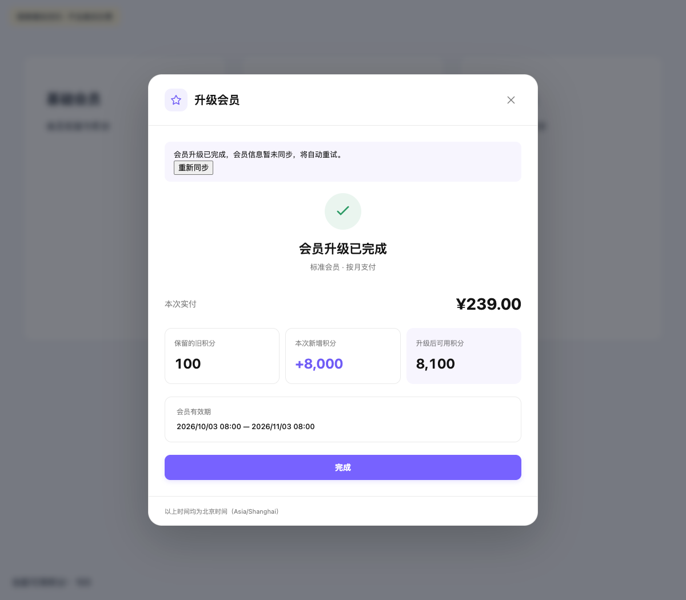
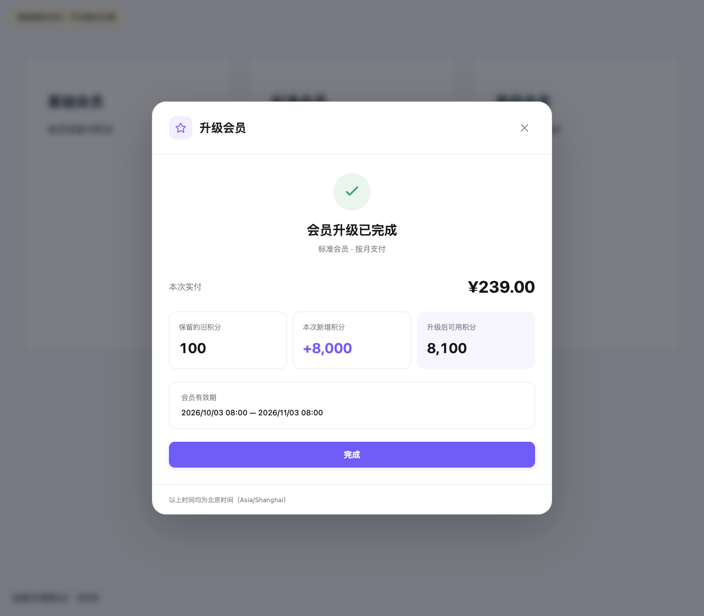

# 会员升级 CR 修复验证

验证日期：2026-10-03。配套后端 PR：<https://github.com/liubei-ai/zerocut-workspace-server/pull/30>。

## 权益刷新行为

会员和钱包请求全部成功后才提交状态；刷新失败保留当前工作区最后成功的数据。并发刷新等待同一次请求；工作区切换同步清空旧状态并丢弃旧响应。升级交付后的同步失败独立于支付状态：按 3、10、30 秒重试，此后每 30 秒重试；页面卸载或工作区切换取消任务。刷新成功之后才记录同步标记。

“重新同步”仅刷新会员和钱包，不调用创建、继续付款或签约接口。升级已完成时仍保留完成回执，并显示同步状态。中文、英文和日文均提供对应文案。

## 自动化

- 六个会员升级相关 Vitest 文件，30 项通过（Store、会员页、账单页、管理面板、升级弹窗）。
- `vp check`：0 errors、103 warnings；生产模式 `vp run build` 通过。
- 全量 Vitest：56 项通过、1 项失败。失败来自未改动的 `src/views/admin/utils/exportGrantCsv.spec.ts`：当前实现导出“开通月数”列，但测试期望的表头缺少该列；实现及测试均与本次修复前 HEAD 一致。
- Vitest 有既存的 10 秒关闭超时提示；相关测试退出码为 0。

## 独立 Chromium 验证

挂载实际 Vue 弹窗与 Pinia Store，使用新浏览器上下文，不载入用户账户或 Cookie。支付接口使用隔离夹具，二维码为不可支付的模拟链接；会员与钱包请求在浏览器网络层模拟。此验证不代表真实微信商户端验证。

1. 确认升级后，显示 Native 支付二维码。
2. 模拟确认付款并完成交付，钱包的第一次升级刷新失败。
3. 仍显示“会员升级已完成”和同步失败提示；旧积分保持 100。
4. 点击“重新同步”后，同步成功，当前积分变为 8100。
5. 创建支付订单接口始终只调用一次，页面错误为 0。

| 同步失败保留完成回执                                      | 手动重试成功                                                  |
| --------------------------------------------------------- | ------------------------------------------------------------- |
|  |  |

管理端显示按订单关联的续费问题，支持未解决筛选、原订单对账以及带凭证的线下处理结果。服务器校验订单所属升级与账户，原升级已关闭也可处理续费问题；本次没有新增自动退款。

## 处理队列样式优化

处理队列采用列表与详情分栏，使用本地化套餐名称和状态标签。付款、交付、续费与处理期限集中展示；处理原因、用户进度、订单结果和实际通知证据分组排列，审计记录按时间线展示。窄屏按容器宽度切换为单栏，控件支持键盘焦点及暗色主题。

验证：处理面板现有 3 项权限、筛选和幂等操作测试通过；`vp check` 0 errors / 103 既存 warnings；生产构建通过。独立 Chromium 使用示例数据检查 1440 px 桌面、390 px 手机、明暗主题及中英日文，横向溢出与页面错误均为 0；筛选、选中记录和线下结果字段切换正常，浏览器验证未提交管理动作。

- [桌面处理队列](membership-upgrade/admin-queue-desktop.png)
- [桌面暗色主题](membership-upgrade/admin-queue-dark.png)
- [手机队列](membership-upgrade/admin-queue-mobile.png)
- [手机暗色主题](membership-upgrade/admin-queue-mobile-dark.png)
- [手机处理详情](membership-upgrade/admin-queue-mobile-detail.png)

## 年付升级入口修正

继续不支持有效月付会员升级到年付。年付卡片显示禁用的“暂不支持升级”按钮与原因；即使后端缺少年付选项或错误返回可升级，页面及点击处理函数也阻止进入报价、付款或签约。无有效会员或会员已到期时，保留普通年付购买入口。补齐中英日文按钮文案，后端规则保持不变。

验证：会员页 19 项 Vitest 通过，包含两种月付来源、两种年付目标、缺少或错误的升级选项及到期后的普通购买；后端现有资格规则 38 项 Jest 通过。`vp check` 0 errors / 103 既存 warnings，生产构建通过。隔离 Chromium 挂载实际会员页面，分别验证按月支付和连续包月账户的三个年付按钮均禁用，报价调用、写入请求及页面错误均为 0；未发起真实付款。

- [年付升级禁用状态](membership-upgrade/annual-upgrade-unavailable.png)

## 手机号灰度入口隐藏

升级创建入口遵循后端 `available` / `previewOnly` 资格：有效会员没有任何可升级或可预览选项时，隐藏所有套餐升级按钮和禁用提示；资格未加载也不展示入口。已开放账户保留禁用的降档及年付说明。未开通或已到期的会员保留普通购买，已有未关闭升级操作保留独立的“查看进行中的升级”入口。隐藏入口的点击处理也不会创建报价、普通付款或签约，不再打开无资格的升级弹窗。

本次仅修正前端，未修改服务端手机号灰度判断及用户本地配置。手机号仍由服务端按工作区所有者的持久化手机号判断，前端不保存或判断手机号白名单。

验证：7 个相关 Vitest 文件、48 项测试通过，覆盖灰度未命中、资格未加载、普通购买、本地预览、已有订单恢复、两个定价组件布局及原有会员升级回归。`vp check` 0 errors / 103 既存 warnings，生产构建通过。隔离 Chromium 挂载实际会员页面，验证灰度未命中、开放及已到期三种状态在按月支付、连续包月、按年支付页签上的入口行为；报价调用、写入请求及页面错误均为 0，未使用真实账号或发起微信支付。

- [灰度未命中时隐藏升级入口](membership-upgrade/phone-rollout-hidden.png)
