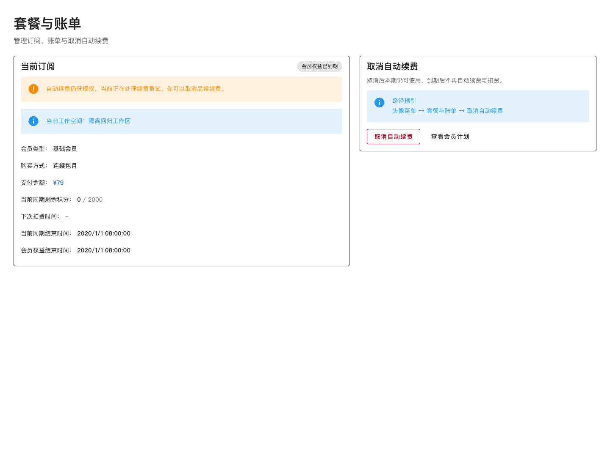
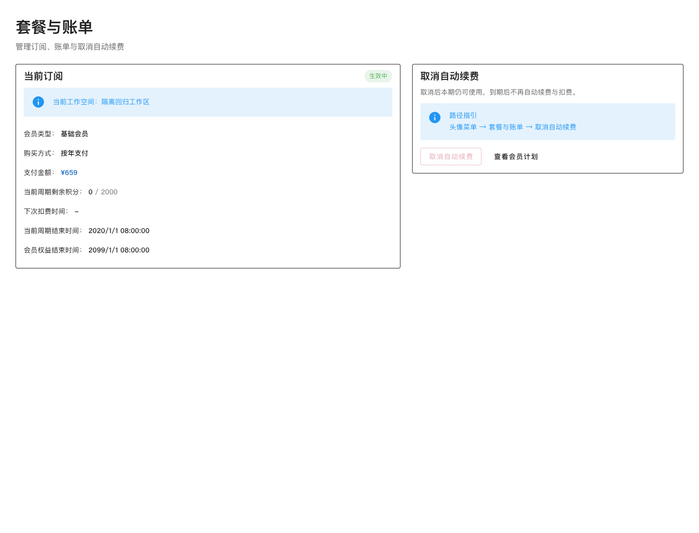
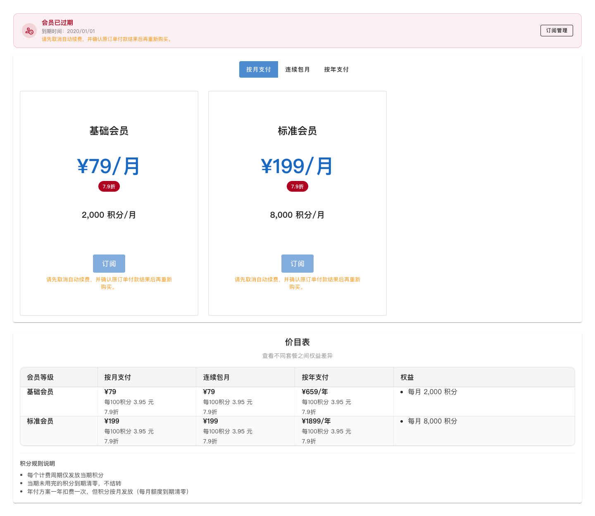

# 会员升级整体 CR 前端验证

2026-10-03，对应 PR #19 与后端 PR #30。

## 行为

会员 Store、套餐页和账单页统一按权益字段判断会员有效性。真实权益到期与自动续费授权分别展示，年付月度积分边界不代表年度权益结束；购买方式和权益结束时间分别展示。取消入口优先使用 canCancelAutoRenewal，旧接口回退依据 autoRenew 和 ACTIVE/PAST_DUE，取消不再要求权益尚未结束。

过期但续费仍获授权的账户阻止再次购买，提示先取消续费、确认原订单付款结果。取消请求捕获原工作区及订阅身份，切换工作区或卸载后的旧响应不覆盖当前页面。取消成功后权益刷新失败不会误报取消失败，也不发起新的付款。

保留既有共享刷新 Promise、失败保留数据、工作区请求隔离以及升级完成后的独立同步重试。会员到期后仍获取真实钱包余额，永久或充值积分不会因会员过期被显示为零。管理端按订单标记“原订阅订单／升级订阅订单”，原升级关闭后也可恢复源续费问题。

新增文案涵盖中文、英文和日文；年付升级、手机号灰度、基线移除的业务限制未改变。

## 验证

- 全量 Vite+ 测试：84 项通过、1 项既存 CSV 表头差异失败（exportGrantCsv.spec.ts）；实现包含“开通月数”，旧断言缺失。未修改无关预期。
- 会员相关 7 个测试文件 / 54 项通过。新增权益辅助判断、到期仍保留钱包、旧接口兼容、逾期取消、年付月度边界、取消期间工作区切换和取消后同步失败测试。
- vp check：0 errors / 103 既存 warnings；vp run build 通过。全量测试保留既存 Vite 退出等待提示。
- Chrome 隔离上下文挂载真实 PlansAndBillingView、MembershipPlansView、Vue/Vuetify/Pinia，使用仅本地测试接口，禁止非回环网络请求。
- 逾期仍授权：权益显示到期、重试授权提示可见，取消按钮可点击；确认后 cancelCalls=1、paymentCalls=0，取消入口禁用，无页面错误。
- 重新购买：两个真实套餐卡片的订阅按钮均禁用并提示先取消及查证原单；paymentCalls=0，无页面错误。
- 年付：月度积分期已结束、年度权益未结束时仍显示“生效中／按年支付”，单独显示年度权益结束时间，无页面错误。

本次未进行真实微信扫码支付或生产验证。完整原升级模拟流程由既有弹窗/Store 测试及后端隔离 PostgreSQL 流程回归覆盖；支付商户验证仍需在灰度环境由用户扫码。

## 隔离数据截图

发布顺序为兼容后端、前端、存量复核、手机号灰度；生产新增升级保持关闭，回调与恢复任务继续运行。后端只读修复工具与完整回归记录见后端 docs/membership-upgrade-overall-cr-validation.md。
