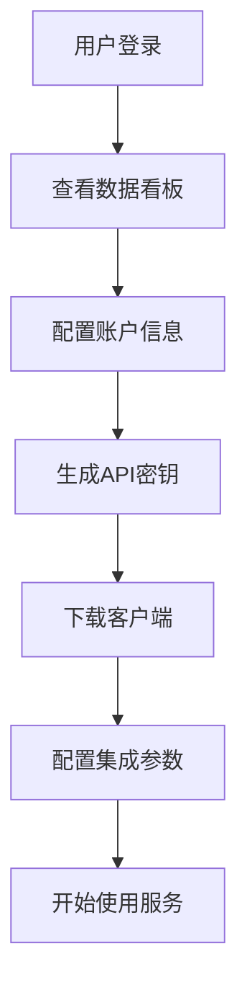
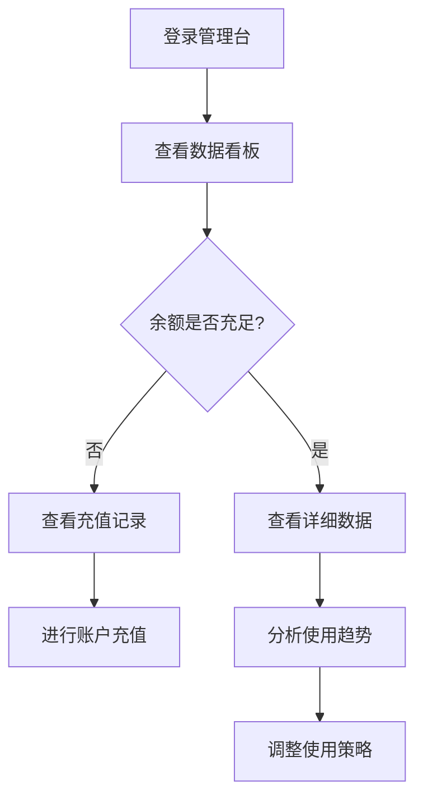
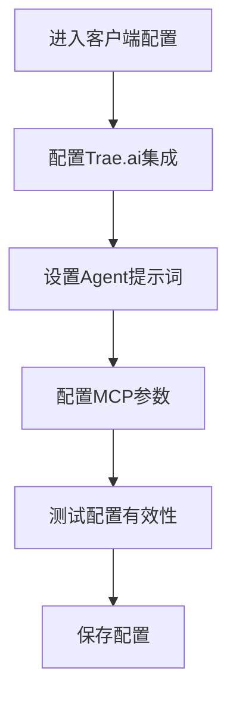

# Zerocut 视频 Agent 管理台功能分析文档

## 1. 业务概述

### 1.1 产品定位

Zerocut 是一个革命性的视频 Agent 产品，能够以传统成本的 1/100 快速创作视频内容。本管理台作为 Zerocut 的核心控制中心，面向产品使用者提供全方位的账户管理、数据监控和配置服务。

### 1.2 核心价值主张

- **成本效益**：大幅降低视频制作成本
- **效率提升**：快速生成高质量视频内容
- **智能化**：AI 驱动的视频创作流程
- **可控性**：完整的管理和监控能力

### 1.3 目标用户

- 内容创作者
- 营销团队
- 企业用户
- 开发者和技术集成商

### 1.4 核心业务规则

**用户注册与工作空间管理**

- 新用户注册成功后，如果没有关联的workspace，系统将自动创建一个默认工作空间
- 默认工作空间命名规则："用户名-默认工作空间" 或 "Default Workspace"
- 每个用户至少拥有一个工作空间，确保用户可以立即开始使用服务
- 工作空间ID作为用户数据隔离的基础标识符

## 2. 功能架构分析

### 2.1 系统架构概览

```
┌─────────────────────────────────────────────────────────┐
│                    Zerocut 管理台                        │
├─────────────────┬─────────────────┬─────────────────────┤
│   数据看板      │   账户管理      │   业务配置          │
│   Dashboard     │   Account Mgmt  │   Configuration     │
├─────────────────┼─────────────────┼─────────────────────┤
│ • 实时监控      │ • 用户信息      │ • API 密钥管理      │
│ • 数据统计      │ • 充值记录      │ • 客户端配置        │
│ • 趋势分析      │ • 权限管理      │ • 系统集成          │
└─────────────────┴─────────────────┴─────────────────────┘
```

### 2.2 核心功能模块

#### 2.2.1 数据看板 (Dashboard)

**业务目标**：提供实时的业务运营数据监控和分析能力

**功能特性**：

- **账户余额监控**：实时显示账户余额变化趋势
- **使用量统计**：
  - 生成视频总时长（分钟级统计）
  - 生成图片数量（张数统计）
  - 合成视频总数量（个数统计）
  - 日消费金额（元为单位）
- **数据可视化**：
  - 折线图：视频时长趋势、消费金额趋势
  - 柱状图：图片数量、视频数量分布
  - 周期性数据展示（周一至周日）

**关键指标**：

- 账户余额：¥1,234.56（示例数据）
- 日生成视频时长：2,435分钟
- 日生成图片数量：1,234张
- 日合成视频数量：89个
- 日消费：¥156.78

#### 2.2.2 账户管理 (Account Management)

**业务目标**：提供完整的用户账户信息管理和 API 密钥管理能力

**功能模块**：

**A. 账户信息管理**

- 用户名：admin_user
- 邮箱：admin@videoapp.com（支持验证状态显示）
- 手机号：+86 138\*\*\*\*8888（支持验证状态显示）
- 工作空间ID：ws_A9tL7xY2pQw3mN8kR5vB
- 安全设置：密码修改、邮箱验证、手机验证

**B. API 密钥管理**

- **密钥类型**：
  - 生产环境密钥
  - 测试环境密钥
  - 开发环境密钥
- **密钥信息**：
  - 密钥名称和标识
  - 创建时间和最后使用时间
  - 状态管理（活跃/非活跃）
  - 安全显示（支持显示/隐藏切换）
- **操作功能**：
  - 创建新密钥
  - 复制密钥到剪贴板
  - 删除密钥
  - 密钥使用统计

**C. 工作空间协作管理**

- **工作空间信息**：
  - 工作空间名称和描述
  - 创建时间和所有者信息
  - 成员数量和权限分布
  - 工作空间状态（活跃/非活跃）
- **成员管理**：
  - 成员列表展示（头像、姓名、邮箱、权限、加入时间）
  - 邀请新成员（邮箱邀请、权限分配）
  - 权限管理（超级管理员、普通用户、只读用户）
  - 移除成员功能
- **邀请管理**：
  - 待处理邀请列表
  - 邀请状态跟踪（已发送、已接受、已拒绝、已过期）
  - 重新发送邀请
  - 撤销邀请

#### 2.2.3 充值记录 (Recharge Records)

**业务目标**：提供完整的账户充值历史记录和财务管理能力

**功能特性**：

- **记录查询**：
  - 时间范围筛选（30天、7天、自定义）
  - 状态筛选（全部、成功、处理中、失败）
  - 关键词搜索（订单号、充值记录ID）
- **支付方式**：
  - 支付宝
  - 微信支付
  - 银行卡
- **记录详情**：
  - 充值金额
  - 支付方式
  - 订单状态（成功/处理中/失败）
  - 创建时间和完成时间
  - 第三方订单号
- **数据导出**：支持充值记录导出功能

#### 2.2.4 详细数据 (Detailed Data)

**业务目标**：提供深度的业务数据分析和历史趋势查看能力

**数据维度**：

- **消费数据**：按小时统计的消费金额变化
- **视频时长数据**：按小时统计的视频生成时长
- **图片数量数据**：按小时统计的图片生成数量

**时间范围**：

- 今日数据（24小时粒度）
- 昨日数据
- 近7天数据
- 自定义时间范围

**数据展示**：

- 实时数据更新
- 趋势图表展示
- 数据对比分析
- 峰值和低谷时段识别

#### 2.2.5 客户端配置 (Client Configuration)

**业务目标**：提供系统集成和客户端配置管理能力

**配置模块**：

**A. Trae.ai 集成配置**

- 客户端下载链接管理
- 版本信息显示（当前版本：1.2.3）
- 启用/禁用控制
- 一键下载功能

**B. Agent 提示词配置**

- **系统提示词**：定义 AI Agent 的基础行为模式
- **用户提示词**：自定义用户交互模板
- **模型参数**：
  - 最大令牌数：100,000
  - 温度参数：0.7
  - 模型选择：claude-4-sonnet

**C. MCP (Model Context Protocol) 配置**

- JSON 格式的服务器配置
- 环境变量管理（API_KEY、项目路径等）
- 配置验证和错误处理
- 一键复制配置功能

## 3. 用户体验流程分析

### 3.1 核心用户流程

#### 流程1：新用户入门流程



#### 流程2：日常监控流程



#### 流程3：系统配置流程



### 3.2 关键决策点分析

**决策点1：余额不足处理**

- 触发条件：账户余额低于预设阈值
- 决策选项：立即充值 / 调整使用频率 / 暂停服务
- 业务影响：服务连续性、用户体验

**决策点2：API密钥管理**

- 触发条件：密钥即将过期或安全风险
- 决策选项：更新密钥 / 创建新密钥 / 撤销旧密钥
- 业务影响：系统安全性、服务稳定性

**决策点3：配置变更**

- 触发条件：业务需求变化或性能优化需求
- 决策选项：更新配置 / 回滚配置 / 测试新配置
- 业务影响：服务质量、成本控制

## 4. 业务规则定义

### 4.1 账户管理规则

| 规则类型 | 条件            | 动作         | 优先级 |
| -------- | --------------- | ------------ | ------ |
| 余额预警 | 余额 < ¥100     | 显示充值提醒 | 高     |
| API密钥  | 30天未使用      | 标记为非活跃 | 中     |
| 安全验证 | 邮箱/手机未验证 | 限制部分功能 | 高     |

### 4.2 数据展示规则

| 数据类型 | 更新频率 | 保留周期 | 精度   |
| -------- | -------- | -------- | ------ |
| 实时数据 | 5分钟    | 24小时   | 分钟级 |
| 历史数据 | 1小时    | 30天     | 小时级 |
| 统计数据 | 24小时   | 1年      | 天级   |

### 4.3 权限控制规则

| 功能模块 | 访问权限     | 操作权限 | 审计要求     |
| -------- | ------------ | -------- | ------------ |
| 数据看板 | 工作空间成员 | 只读     | 访问日志     |
| 账户管理 | 账户所有者   | 读写     | 操作日志     |
| 充值记录 | 工作空间成员 | 只读     | 查看日志     |
| 系统配置 | 超级管理员   | 读写     | 变更日志     |
| 成员管理 | 超级管理员   | 读写     | 权限变更日志 |
| 邀请管理 | 超级管理员   | 读写     | 邀请操作日志 |

### 4.4 工作空间协作规则

| 权限类型   | 数据看板 | 账户管理 | API密钥 | 成员管理 | 充值记录 |
| ---------- | -------- | -------- | ------- | -------- | -------- |
| 超级管理员 | 读写     | 读写     | 读写    | 读写     | 读写     |
| 普通用户   | 读写     | 只读     | 读写    | 只读     | 只读     |
| 只读用户   | 只读     | 只读     | 只读    | 只读     | 只读     |

**协作业务规则**：

- 每个工作空间必须至少有一个超级管理员
- 超级管理员可以邀请用户并分配权限
- 普通用户可以使用核心功能但不能管理成员
- 只读用户只能查看数据，不能进行任何操作
- 工作空间数据完全隔离，成员只能访问所属工作空间的数据

## 5. 性能和扩展性考虑

### 5.1 性能优化策略

- **前端优化**：
  - 组件懒加载
  - 图表数据虚拟化
  - 缓存策略优化
- **数据加载**：
  - 分页加载
  - 增量更新
  - 预加载关键数据

### 5.2 扩展性设计

- **模块化架构**：支持功能模块独立开发和部署
- **配置驱动**：通过配置文件控制功能开关
- **插件机制**：支持第三方集成和自定义功能

## 6. 安全性分析

### 6.1 数据安全

- **敏感信息保护**：API密钥脱敏显示
- **传输安全**：HTTPS + 数据加密
- **存储安全**：本地数据加密存储

### 6.2 访问控制

- **身份认证**：用户登录验证
- **权限管理**：基于角色的访问控制
- **会话管理**：安全的会话超时机制

## 7. 开发路线图与建议

### 7.0 即时开发任务（基于反馈调整）

**阶段一：用户认证系统（1-2周）**

1. 设计用户认证系统架构（登录/注册/密码重置）
2. 创建登录页面UI组件，支持邮箱/手机号登录
3. 创建注册页面UI组件，包含邮箱验证和手机验证
4. 实现前端表单验证逻辑（邮箱格式、密码强度等）
5. 实现用户认证状态管理和路由守卫
6. **实现注册后自动创建默认工作空间逻辑**
7. **添加工作空间初始化和用户关联功能**
8. 优化登录注册页面的移动端响应式设计
9. 创建模拟认证API接口，为后端开发做准备

**阶段一补充：工作空间协作功能（1-2周）**

1. **设计工作空间多用户协作架构**
2. **创建成员管理页面UI组件**
   - 成员列表展示
   - 权限标识和状态显示
   - 操作按钮（邀请、编辑、删除）
3. **实现用户邀请功能**
   - 邀请表单组件
   - 邮箱验证和权限选择
   - 邀请状态管理
4. **实现权限管理系统**
   - 权限验证中间件
   - 基于角色的UI组件显示控制
   - 操作权限验证
5. **创建邀请接受页面**
   - 邀请详情展示
   - 接受/拒绝操作
   - 未注册用户引导注册流程
6. **实现工作空间切换功能**
   - 工作空间选择器组件
   - 数据隔离和状态管理
7. **添加协作相关的模拟API接口**

**阶段二：核心功能完善（2-3周）**

- 完善现有功能模块的数据接口
- 实现后端API集成
- 添加错误处理和用户反馈机制

### 7.1 优先级排序 (MoSCoW)

**Must Have (必须有) - 第一阶段**

- 🔥 **用户认证系统**：登录、注册、密码重置功能（最高优先级）
- 🔥 **认证状态管理**：用户会话管理和路由守卫
- 🔥 **基础UI框架**：响应式布局和移动端适配

**Must Have (必须有) - 第二阶段**

- 完善数据看板的实时数据接口
- 实现账户管理的后端API集成
- 完成充值功能的支付接口对接

**Should Have (应该有)**

- 添加数据导出功能
- 实现更详细的权限控制
- 优化移动端响应式设计
- 模拟API接口，为后端开发做准备

**Could Have (可以有)**

- 添加数据分析报告功能
- 实现多语言支持
- 集成更多第三方服务

**Won't Have (暂不考虑)**

- 复杂的工作流引擎
- 高级数据挖掘功能
- 企业级SSO集成

### 7.2 后端API设计建议

**认证相关API**

```
POST /api/auth/register
POST /api/auth/login
POST /api/auth/logout
POST /api/auth/refresh-token
POST /api/auth/forgot-password
POST /api/auth/reset-password
```

**工作空间管理API**

```
GET /api/workspace/list          # 获取用户工作空间列表
POST /api/workspace/create       # 创建新工作空间
GET /api/workspace/{id}          # 获取工作空间详情
PUT /api/workspace/{id}          # 更新工作空间信息
DELETE /api/workspace/{id}       # 删除工作空间
POST /api/workspace/create-default/{userId}  # 为新用户创建默认工作空间
```

**工作空间协作API**

```
# 成员管理
GET /api/workspace/{id}/members     # 获取工作空间成员列表
POST /api/workspace/{id}/invite     # 邀请用户加入工作空间
PUT /api/workspace/{id}/members/{userId}/role  # 修改成员权限
DELETE /api/workspace/{id}/members/{userId}    # 移除工作空间成员

# 邀请管理
GET /api/workspace/{id}/invitations        # 获取工作空间邀请列表
GET /api/invitations/token/{token}         # 通过令牌获取邀请详情
POST /api/invitations/{id}/accept          # 接受邀请
POST /api/invitations/{id}/reject          # 拒绝邀请
DELETE /api/invitations/{id}               # 撤销邀请
POST /api/invitations/{id}/resend          # 重新发送邀请

# 权限验证
GET /api/workspace/{id}/permissions/{userId}  # 获取用户在工作空间的权限
POST /api/workspace/{id}/check-permission     # 检查用户操作权限
```

**核心业务API**

```
GET /api/dashboard/stats
GET /api/account/profile
PUT /api/account/profile
GET /api/recharge/records
GET /api/data/detailed
GET /api/config/client
PUT /api/config/client
```

**注册流程API调用顺序**

1. `POST /api/auth/register` - 用户注册
2. `POST /api/workspace/init-default` - 自动创建默认工作空间
3. `POST /api/auth/login` - 自动登录（可选）

### 7.3 监控和运维

- **错误监控**：集成错误追踪系统
- **性能监控**：页面加载和API响应时间监控
- **用户行为分析**：用户操作路径和使用习惯分析

## 8. 需求确认与反馈

基于项目需求确认，以下是关键问题的明确答案：

### 8.1 业务目标确认

- ✅ **核心竞争优势**：确认为"1/100成本"的视频创作能力
- ⚠️ **目标用户群体**：当前聚焦主要用户群体，其他细分市场待进一步明确

### 8.2 功能优先级

- 🔥 **最紧急功能**：**登录和注册系统**（最高优先级）
- ✅ **业务场景**：暂无特定业务场景需要优先支持

### 8.3 技术约束

- ✅ **技术栈**：无特定要求或限制，当前技术选型合适
- ⚠️ **后端API**：尚未开始开发，需要前端先行设计接口规范

### 8.4 用户体验

- ✅ **设计规范**：无特定标准，可采用现代化设计原则
- 📱 **移动端支持**：需要考虑移动端适配，优先级中等

### 8.5 安全合规

- ✅ **安全要求**：无特定合规要求
- ✅ **数据隐私**：无特殊隐私保护要求，遵循基本安全原则即可

---

**文档版本**：v1.0  
**创建日期**：2025年9月  
**最后更新**：2025年9月  
**负责人**：前端开发团队  
**审核状态**：待审核
