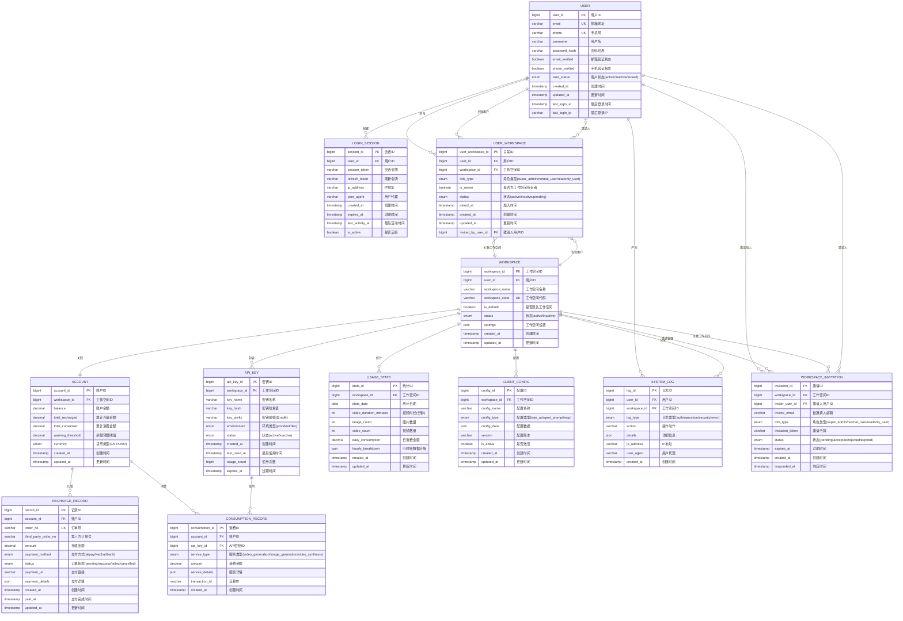

# Zerocut 视频 Agent 管理台 - ER 图设计

## 数据库设计概览

基于DDD领域模型，本ER图展示了Zerocut视频Agent管理台的完整数据库结构设计，包含核心实体、关系和约束条件。

## ER 图



## 核心实体说明

### 1. 用户管理域

#### USER (用户表)

- **主键**: user_id
- **唯一约束**: email, phone
- **核心字段**: 用户基本信息、验证状态、登录信息
- **业务规则**:
  - 邮箱和手机号必须唯一
  - 密码采用哈希存储
  - 支持账户锁定机制

#### LOGIN_SESSION (登录会话表)

- **主键**: session_id
- **外键**: user_id → USER.user_id
- **核心字段**: 会话令牌、设备信息、活跃状态
- **业务规则**:
  - 会话令牌24小时过期
  - 支持多设备同时登录
  - 记录用户活动轨迹

### 2. 工作空间域

#### WORKSPACE (工作空间表)

- **主键**: workspace_id
- **外键**: user_id → USER.user_id (创建者)
- **唯一约束**: workspace_code
- **核心字段**: 工作空间名称、代码、默认标识
- **业务规则**:
  - 每个用户至少有一个默认工作空间
  - 工作空间代码全局唯一
  - 支持工作空间级别的设置配置
  - 支持多用户协作

#### USER_WORKSPACE (用户工作空间关联表)

- **主键**: user_workspace_id
- **外键**: user_id → USER.user_id, workspace_id → WORKSPACE.workspace_id
- **唯一约束**: (user_id, workspace_id)
- **核心字段**: 角色类型、所有者标识、状态、加入时间
- **业务规则**:
  - 实现用户与工作空间的多对多关系
  - 支持三种角色类型：超级管理员、普通用户、只读用户
  - 每个工作空间必须有且仅有一个所有者
  - 所有者默认为超级管理员权限
  - 支持用户状态管理（活跃/非活跃/待审核）

#### WORKSPACE_INVITATION (工作空间邀请表)

- **主键**: invitation_id
- **外键**: workspace_id → WORKSPACE.workspace_id, inviter_user_id → USER.user_id
- **核心字段**: 被邀请人邮箱、角色类型、邀请令牌、状态
- **业务规则**:
  - 邀请令牌7天有效期
  - 支持邀请未注册用户
  - 邀请状态流转：待处理→已接受/已拒绝/已过期
  - 只有超级管理员可以邀请其他用户
  - 记录完整的邀请审计轨迹

### 3. 财务管理域

#### ACCOUNT (账户表)

- **主键**: account_id
- **外键**: workspace_id → WORKSPACE.workspace_id
- **核心字段**: 余额、累计金额、预警阈值
- **业务规则**:
  - 每个工作空间对应一个账户
  - 余额不能为负数
  - 支持多币种(预留)

#### RECHARGE_RECORD (充值记录表)

- **主键**: record_id
- **外键**: account_id → ACCOUNT.account_id
- **唯一约束**: order_no
- **核心字段**: 充值金额、支付方式、订单状态
- **业务规则**:
  - 订单号全局唯一
  - 支持多种支付方式
  - 完整的支付状态流转

#### CONSUMPTION_RECORD (消费记录表)

- **主键**: consumption_id
- **外键**: account_id, api_key_id
- **核心字段**: 消费金额、服务类型、交易详情
- **业务规则**:
  - 记录每次API调用的消费
  - 关联具体的API密钥
  - 支持不同服务类型的计费

### 4. API管理域

#### API_KEY (API密钥表)

- **主键**: api_key_id
- **外键**: workspace_id → WORKSPACE.workspace_id
- **核心字段**: 密钥信息、环境类型、使用统计
- **业务规则**:
  - 密钥采用哈希存储
  - 支持环境隔离
  - 30天未使用自动标记为非活跃

### 5. 数据统计域

#### USAGE_STATS (使用统计表)

- **主键**: stats_id
- **外键**: workspace_id → WORKSPACE.workspace_id
- **核心字段**: 日期、各类使用量、消费金额
- **业务规则**:
  - 按日聚合统计数据
  - 支持小时级数据分解
  - 用于数据看板展示

### 6. 配置管理域

#### CLIENT_CONFIG (客户端配置表)

- **主键**: config_id
- **外键**: workspace_id → WORKSPACE.workspace_id
- **核心字段**: 配置类型、配置数据、版本信息
- **业务规则**:
  - 支持多种配置类型
  - JSON格式存储配置数据
  - 版本化管理配置变更

### 7. 审计日志域

#### SYSTEM_LOG (系统日志表)

- **主键**: log_id
- **外键**: user_id, workspace_id
- **核心字段**: 日志类型、操作动作、详细信息
- **业务规则**:
  - 记录所有关键操作
  - 支持多种日志类型
  - 用于安全审计和问题排查
  - 特别记录权限变更和用户邀请操作

## 权限控制模型

### 角色权限定义

#### 超级管理员 (super_admin)

- **工作空间管理**: 完全控制权限
- **用户管理**: 邀请、移除、角色变更
- **财务管理**: 查看充值记录、消费记录
- **API管理**: 创建、删除、管理所有API密钥
- **配置管理**: 修改所有客户端配置
- **数据访问**: 查看所有统计数据和详细数据

#### 普通用户 (normal_user)

- **工作空间管理**: 查看工作空间信息
- **用户管理**: 查看成员列表
- **财务管理**: 查看账户余额和自己的消费记录
- **API管理**: 创建、管理自己的API密钥
- **配置管理**: 查看客户端配置
- **数据访问**: 查看基础统计数据

#### 只读用户 (readonly_user)

- **工作空间管理**: 查看工作空间信息
- **用户管理**: 查看成员列表
- **财务管理**: 查看账户余额
- **API管理**: 查看API密钥列表（不显示密钥内容）
- **配置管理**: 查看客户端配置
- **数据访问**: 查看基础统计数据

### 权限控制规则

1. **工作空间所有者**：自动获得超级管理员权限，且不可被移除
2. **角色继承**：超级管理员 > 普通用户 > 只读用户
3. **操作审计**：所有权限变更操作必须记录日志
4. **最小权限原则**：默认分配最小必要权限
5. **权限隔离**：不同工作空间的权限完全隔离

## 索引设计

### 主要索引

```sql
-- 用户表索引
CREATE INDEX idx_user_email ON USER(email);
CREATE INDEX idx_user_phone ON USER(phone);
CREATE INDEX idx_user_status ON USER(user_status);
CREATE INDEX idx_user_created_at ON USER(created_at);

-- 工作空间表索引
CREATE INDEX idx_workspace_user_id ON WORKSPACE(user_id);
CREATE INDEX idx_workspace_code ON WORKSPACE(workspace_code);
CREATE INDEX idx_workspace_default ON WORKSPACE(user_id, is_default);

-- 用户工作空间关联表索引
CREATE UNIQUE INDEX idx_user_workspace_unique ON USER_WORKSPACE(user_id, workspace_id);
CREATE INDEX idx_user_workspace_user_id ON USER_WORKSPACE(user_id);
CREATE INDEX idx_user_workspace_workspace_id ON USER_WORKSPACE(workspace_id);
CREATE INDEX idx_user_workspace_role ON USER_WORKSPACE(role_type);
CREATE INDEX idx_user_workspace_status ON USER_WORKSPACE(status);
CREATE INDEX idx_user_workspace_owner ON USER_WORKSPACE(workspace_id, is_owner);

-- 工作空间邀请表索引
CREATE INDEX idx_invitation_workspace_id ON WORKSPACE_INVITATION(workspace_id);
CREATE INDEX idx_invitation_inviter ON WORKSPACE_INVITATION(inviter_user_id);
CREATE INDEX idx_invitation_email ON WORKSPACE_INVITATION(invitee_email);
CREATE INDEX idx_invitation_token ON WORKSPACE_INVITATION(invitation_token);
CREATE INDEX idx_invitation_status ON WORKSPACE_INVITATION(status);
CREATE INDEX idx_invitation_expires ON WORKSPACE_INVITATION(expires_at);

-- API密钥表索引
CREATE INDEX idx_api_key_workspace_id ON API_KEY(workspace_id);
CREATE INDEX idx_api_key_status ON API_KEY(status);
CREATE INDEX idx_api_key_last_used ON API_KEY(last_used_at);

-- 充值记录表索引
CREATE INDEX idx_recharge_account_id ON RECHARGE_RECORD(account_id);
CREATE INDEX idx_recharge_status ON RECHARGE_RECORD(status);
CREATE INDEX idx_recharge_created_at ON RECHARGE_RECORD(created_at);
CREATE INDEX idx_recharge_order_no ON RECHARGE_RECORD(order_no);

-- 使用统计表索引
CREATE INDEX idx_usage_workspace_date ON USAGE_STATS(workspace_id, stats_date);
CREATE INDEX idx_usage_stats_date ON USAGE_STATS(stats_date);

-- 消费记录表索引
CREATE INDEX idx_consumption_account_id ON CONSUMPTION_RECORD(account_id);
CREATE INDEX idx_consumption_api_key_id ON CONSUMPTION_RECORD(api_key_id);
CREATE INDEX idx_consumption_created_at ON CONSUMPTION_RECORD(created_at);
CREATE INDEX idx_consumption_service_type ON CONSUMPTION_RECORD(service_type);

-- 系统日志表索引
CREATE INDEX idx_log_user_id ON SYSTEM_LOG(user_id);
CREATE INDEX idx_log_workspace_id ON SYSTEM_LOG(workspace_id);
CREATE INDEX idx_log_type_created ON SYSTEM_LOG(log_type, created_at);
CREATE INDEX idx_log_created_at ON SYSTEM_LOG(created_at);
```

## 约束条件

### 外键约束

```sql
-- 工作空间外键
ALTER TABLE WORKSPACE ADD CONSTRAINT fk_workspace_user
    FOREIGN KEY (user_id) REFERENCES USER(user_id) ON DELETE CASCADE;

-- 用户工作空间关联外键
ALTER TABLE USER_WORKSPACE ADD CONSTRAINT fk_user_workspace_user
    FOREIGN KEY (user_id) REFERENCES USER(user_id) ON DELETE CASCADE;
ALTER TABLE USER_WORKSPACE ADD CONSTRAINT fk_user_workspace_workspace
    FOREIGN KEY (workspace_id) REFERENCES WORKSPACE(workspace_id) ON DELETE CASCADE;
ALTER TABLE USER_WORKSPACE ADD CONSTRAINT fk_user_workspace_inviter
    FOREIGN KEY (invited_by_user_id) REFERENCES USER(user_id) ON DELETE SET NULL;

-- 工作空间邀请外键
ALTER TABLE WORKSPACE_INVITATION ADD CONSTRAINT fk_invitation_workspace
    FOREIGN KEY (workspace_id) REFERENCES WORKSPACE(workspace_id) ON DELETE CASCADE;
ALTER TABLE WORKSPACE_INVITATION ADD CONSTRAINT fk_invitation_inviter
    FOREIGN KEY (inviter_user_id) REFERENCES USER(user_id) ON DELETE CASCADE;

-- 账户外键
ALTER TABLE ACCOUNT ADD CONSTRAINT fk_account_workspace
    FOREIGN KEY (workspace_id) REFERENCES WORKSPACE(workspace_id) ON DELETE CASCADE;

-- API密钥外键
ALTER TABLE API_KEY ADD CONSTRAINT fk_api_key_workspace
    FOREIGN KEY (workspace_id) REFERENCES WORKSPACE(workspace_id) ON DELETE CASCADE;

-- 充值记录外键
ALTER TABLE RECHARGE_RECORD ADD CONSTRAINT fk_recharge_account
    FOREIGN KEY (account_id) REFERENCES ACCOUNT(account_id) ON DELETE CASCADE;

-- 消费记录外键
ALTER TABLE CONSUMPTION_RECORD ADD CONSTRAINT fk_consumption_account
    FOREIGN KEY (account_id) REFERENCES ACCOUNT(account_id) ON DELETE CASCADE;
ALTER TABLE CONSUMPTION_RECORD ADD CONSTRAINT fk_consumption_api_key
    FOREIGN KEY (api_key_id) REFERENCES API_KEY(api_key_id) ON DELETE SET NULL;
```

### 检查约束

```sql
-- 账户余额约束
ALTER TABLE ACCOUNT ADD CONSTRAINT chk_account_balance
    CHECK (balance >= 0);

-- 充值金额约束
ALTER TABLE RECHARGE_RECORD ADD CONSTRAINT chk_recharge_amount
    CHECK (amount > 0);

-- 消费金额约束
ALTER TABLE CONSUMPTION_RECORD ADD CONSTRAINT chk_consumption_amount
    CHECK (amount >= 0);

-- 邮箱格式约束
ALTER TABLE USER ADD CONSTRAINT chk_user_email
    CHECK (email ~ '^[A-Za-z0-9._%+-]+@[A-Za-z0-9.-]+\.[A-Za-z]{2,}$');

-- 用户工作空间关联约束
ALTER TABLE USER_WORKSPACE ADD CONSTRAINT chk_user_workspace_role
    CHECK (role_type IN ('super_admin', 'normal_user', 'readonly_user'));
ALTER TABLE USER_WORKSPACE ADD CONSTRAINT chk_user_workspace_status
    CHECK (status IN ('active', 'inactive', 'pending'));

-- 工作空间邀请约束
ALTER TABLE WORKSPACE_INVITATION ADD CONSTRAINT chk_invitation_role
    CHECK (role_type IN ('super_admin', 'normal_user', 'readonly_user'));
ALTER TABLE WORKSPACE_INVITATION ADD CONSTRAINT chk_invitation_status
    CHECK (status IN ('pending', 'accepted', 'rejected', 'expired'));
ALTER TABLE WORKSPACE_INVITATION ADD CONSTRAINT chk_invitation_expires
    CHECK (expires_at > created_at);
```

## 数据分区策略

### 时间分区表

```sql
-- 系统日志按月分区
CREATE TABLE SYSTEM_LOG (
    -- 字段定义...
) PARTITION BY RANGE (created_at);

CREATE TABLE SYSTEM_LOG_202401 PARTITION OF SYSTEM_LOG
    FOR VALUES FROM ('2024-01-01') TO ('2024-02-01');

-- 消费记录按月分区
CREATE TABLE CONSUMPTION_RECORD (
    -- 字段定义...
) PARTITION BY RANGE (created_at);

CREATE TABLE CONSUMPTION_RECORD_202401 PARTITION OF CONSUMPTION_RECORD
    FOR VALUES FROM ('2024-01-01') TO ('2024-02-01');
```

## 性能优化建议

### 1. 查询优化

- 使用复合索引优化多条件查询
- 对大表实施分区策略
- 定期清理历史日志数据

### 2. 存储优化

- JSON字段使用GIN索引
- 大文本字段考虑压缩存储
- 冷热数据分离存储

### 3. 缓存策略

- 用户会话信息缓存
- 配置数据缓存
- 统计数据缓存

## 数据安全

### 1. 敏感数据保护

- 密码字段哈希存储
- API密钥哈希存储
- 支付信息加密存储

### 2. 数据备份

- 每日全量备份
- 实时增量备份
- 异地容灾备份

### 3. 访问控制

- 数据库用户权限分离
- 敏感操作审计日志
- 数据访问监控

---

**文档版本**: v1.0  
**创建日期**: 2024年1月  
**数据库类型**: PostgreSQL 17  
**设计原则**: DDD领域驱动设计
