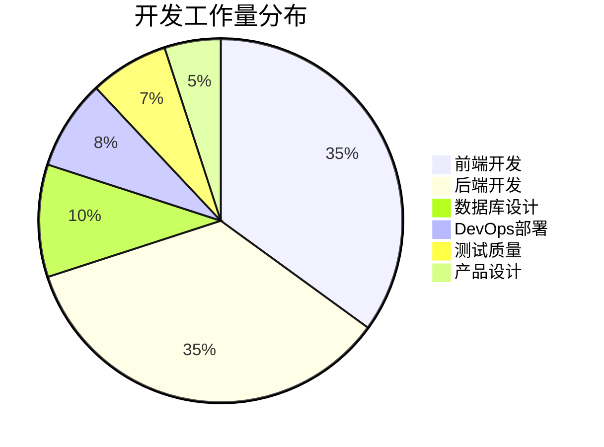
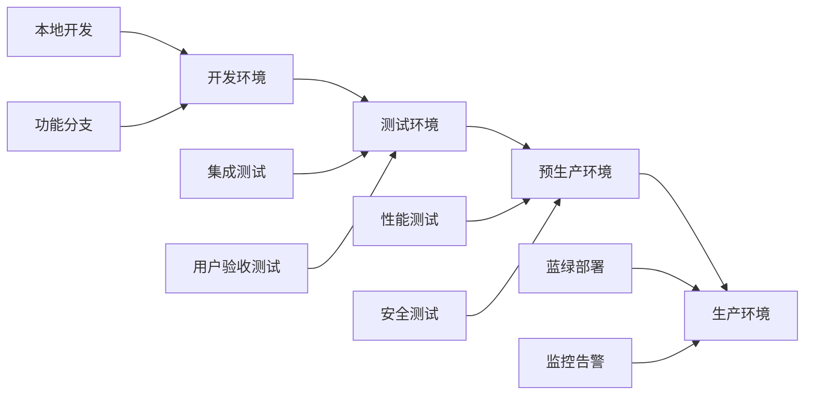

# Zerocut 视频Agent管理平台 - 开发时间线和里程碑计划

## 📅 项目总览

**项目周期**: 12周 (3个月)  
**团队配置**: 前端开发2人 + 后端开发2人 + 全栈开发1人 + 产品经理1人 + UI设计师1人  
**开发模式**: 敏捷开发，2周一个Sprint  
**交付策略**: MVP → 核心功能 → 高级特性 → 优化完善

## 🎯 里程碑规划

### 里程碑 M1: MVP基础版本 (第1-4周)

**目标**: 实现核心用户认证和基础工作空间管理

#### Sprint 1 (第1-2周): 项目基础设施

**Sprint目标**: 搭建开发环境和基础架构

**前端任务** (16人天)

- [x] 项目初始化和开发环境配置 (2天)

  - Vite + React + TypeScript 项目搭建
  - TailwindCSS + 组件库配置
  - ESLint + Prettier 代码规范
  - Git hooks 和提交规范

- [ ] 基础UI组件库开发 (6天)

  - Button、Input、Modal、Toast 等基础组件
  - Layout 布局组件 (Header、Sidebar、Main)
  - 响应式设计适配
  - 主题系统和暗色模式支持

- [ ] 路由和状态管理 (4天)

  - React Router 路由配置
  - Zustand 状态管理架构
  - 全局状态设计 (用户、主题、语言)
  - 路由守卫和权限控制

- [ ] 登录注册页面 (4天)
  - 登录表单组件
  - 注册表单组件
  - 表单验证和错误处理
  - 密码强度检测

**后端任务** (16人天)

- [x] 项目架构搭建 (3天)

  - Node.js + TypeScript + Express 项目初始化
  - 目录结构和分层架构设计
  - 环境配置和日志系统
  - API 文档框架 (Swagger)

- [x] 数据库设计和初始化 (4天)

  - PostgreSQL 数据库设计
  - TypeORM 配置
  - 数据迁移脚本
  - 种子数据准备

- [ ] 用户认证服务 (6天)

  - JWT 认证机制
  - 用户注册/登录 API
  - 密码加密和验证
  - 邮箱验证功能

- [ ] 基础中间件开发 (3天)
  - 认证中间件
  - 错误处理中间件
  - 请求日志中间件
  - 跨域配置

**DevOps任务** (8人天)

- [ ] 开发环境配置 (4天)

  - Docker 开发环境
  - 数据库容器化
  - 开发工具链配置
  - 本地调试环境

- [ ] CI/CD 基础流程 (4天)
  - GitHub Actions 配置
  - 代码质量检查
  - 自动化测试流程
  - 部署脚本准备

**Sprint 1 交付物**:

- ✅ 完整的开发环境
- ✅ 基础UI组件库
- ✅ 用户认证系统
- ✅ 数据库基础架构
- ✅ CI/CD 基础流程

#### Sprint 2 (第3-4周): 核心功能开发

**Sprint目标**: 实现工作空间管理和基础数据展示

**前端任务** (16人天)

- [ ] 工作空间管理界面 (8天)

  - 工作空间列表页面
  - 工作空间创建/编辑表单
  - 成员邀请和管理
  - 权限角色展示

- [ ] 仪表板页面 (6天)

  - 数据概览卡片
  - 基础图表组件 (使用 Recharts)
  - 实时数据更新
  - 响应式布局优化

- [ ] API密钥管理 (2天)
  - API密钥列表
  - 创建/删除密钥
  - 密钥状态管理
  - 安全提示组件

**后端任务** (16人天)

- [ ] 工作空间服务 (8天)

  - 工作空间 CRUD API
  - 成员邀请机制
  - 权限验证逻辑
  - 工作空间统计 API

- [ ] API密钥管理服务 (4天)

  - API密钥生成和管理
  - 密钥权限控制
  - 使用统计记录
  - 安全策略实施

- [ ] 数据统计服务 (4天)
  - 使用数据收集
  - 统计数据计算
  - 报表生成 API
  - 数据缓存策略

**测试任务** (8人天)

- [ ] 单元测试编写 (4天)

  - 前端组件测试
  - 后端服务测试
  - 测试覆盖率 > 80%

- [ ] 集成测试 (4天)
  - API 集成测试
  - 端到端测试
  - 性能基准测试

**Sprint 2 交付物**:

- ✅ 工作空间管理功能
- ✅ 基础数据仪表板
- ✅ API密钥管理
- ✅ 完整的测试覆盖

### 里程碑 M2: 核心业务功能 (第5-8周)

**目标**: 完善业务功能和用户体验

#### Sprint 3 (第5-6周): 财务管理系统

**Sprint目标**: 实现账户充值和消费记录管理

**前端任务** (16人天)

- [ ] 账户管理页面 (6天)

  - 账户余额展示
  - 充值记录列表
  - 消费记录详情
  - 账单导出功能

- [ ] 充值系统界面 (6天)

  - 充值金额选择
  - 支付方式集成
  - 充值状态跟踪
  - 支付结果处理

- [ ] 数据可视化增强 (4天)
  - 消费趋势图表
  - 使用统计图表
  - 自定义时间范围
  - 数据导出功能

**后端任务** (16人天)

- [ ] 财务管理服务 (10天)

  - 账户余额管理
  - 充值记录处理
  - 消费记录统计
  - 财务报表生成

- [ ] 支付系统集成 (6天)
  - 第三方支付接口
  - 支付回调处理
  - 支付安全验证
  - 异常处理机制

**Sprint 3 交付物**:

- ✅ 完整的财务管理系统
- ✅ 支付功能集成
- ✅ 财务数据可视化

#### Sprint 4 (第7-8周): 高级功能开发

**Sprint目标**: 实现配置管理和系统优化

**前端任务** (16人天)

- [ ] 系统配置页面 (6天)

  - 客户端配置管理
  - 系统参数设置
  - 配置导入/导出
  - 配置版本管理

- [ ] 用户体验优化 (6天)

  - 加载状态优化
  - 错误边界处理
  - 国际化支持
  - 无障碍访问优化

- [ ] 移动端适配 (4天)
  - 响应式设计完善
  - 触摸交互优化
  - 移动端专用组件
  - PWA 功能支持

**后端任务** (16人天)

- [ ] 配置管理服务 (6天)

  - 配置项管理 API
  - 配置验证机制
  - 配置变更通知
  - 配置备份恢复

- [ ] 系统监控和日志 (6天)

  - 系统健康检查
  - 性能监控指标
  - 日志收集分析
  - 告警机制实现

- [ ] API 性能优化 (4天)
  - 数据库查询优化
  - 缓存策略实施
  - API 响应时间优化
  - 并发处理优化

**Sprint 4 交付物**:

- ✅ 系统配置管理
- ✅ 监控和日志系统
- ✅ 性能优化完成

### 里程碑 M3: 高级特性和优化 (第9-12周)

**目标**: 实现高级功能和系统优化

#### Sprint 5 (第9-10周): 高级功能实现

**Sprint目标**: 实现数据分析和高级管理功能

**前端任务** (16人天)

- [ ] 高级数据分析 (8天)

  - 多维度数据分析
  - 自定义报表生成
  - 数据钻取功能
  - 预测分析展示

- [ ] 管理员功能 (8天)
  - 用户管理界面
  - 系统设置管理
  - 权限管理界面
  - 审计日志查看

**后端任务** (16人天)

- [ ] 数据分析引擎 (10天)

  - 复杂查询优化
  - 数据聚合算法
  - 报表生成引擎
  - 数据导出服务

- [ ] 管理员服务 (6天)
  - 用户管理 API
  - 权限控制系统
  - 审计日志服务
  - 系统配置 API

**Sprint 5 交付物**:

- ✅ 高级数据分析功能
- ✅ 完整的管理员功能
- ✅ 权限控制系统

#### Sprint 6 (第11-12周): 系统优化和发布准备

**Sprint目标**: 系统优化、安全加固和发布准备

**前端任务** (16人天)

- [ ] 性能优化 (8天)

  - 代码分割和懒加载
  - 图片优化和CDN
  - 缓存策略优化
  - 首屏加载优化

- [ ] 用户体验完善 (8天)
  - 交互动画优化
  - 错误处理完善
  - 帮助文档集成
  - 用户反馈系统

**后端任务** (16人天)

- [ ] 安全加固 (8天)

  - 安全漏洞扫描
  - 数据加密增强
  - API 安全加固
  - 访问控制优化

- [ ] 生产环境优化 (8天)
  - 数据库性能调优
  - 服务器配置优化
  - 监控告警完善
  - 备份恢复测试

**DevOps任务** (16人天)

- [ ] 部署和运维 (16天)
  - 生产环境部署
  - 监控系统配置
  - 自动化运维脚本
  - 灾难恢复方案

**Sprint 6 交付物**:

- ✅ 生产就绪的系统
- ✅ 完整的安全防护
- ✅ 运维监控体系

## 📊 资源分配和工作量估算

### 人力资源分配

| 角色           | 人数    | 总工作量    | 分配说明              |
| -------------- | ------- | ----------- | --------------------- |
| 前端开发工程师 | 2人     | 192人天     | React/TypeScript 专家 |
| 后端开发工程师 | 2人     | 192人天     | Node.js/数据库专家    |
| 全栈开发工程师 | 1人     | 96人天      | 支持前后端开发        |
| DevOps工程师   | 1人     | 48人天      | 部署运维专家          |
| 产品经理       | 1人     | 96人天      | 需求管理和协调        |
| UI/UX设计师    | 1人     | 48人天      | 界面设计和用户体验    |
| **总计**       | **8人** | **672人天** | **12周开发周期**      |

### 技术栈工作量分布



### 功能模块工作量估算

| 功能模块     | 前端(人天) | 后端(人天) | 测试(人天) | 总计    |
| ------------ | ---------- | ---------- | ---------- | ------- |
| 用户认证系统 | 12         | 16         | 6          | 34      |
| 工作空间管理 | 16         | 20         | 8          | 44      |
| 数据仪表板   | 20         | 16         | 6          | 42      |
| 财务管理     | 18         | 22         | 8          | 48      |
| API密钥管理  | 8          | 12         | 4          | 24      |
| 系统配置     | 12         | 14         | 6          | 32      |
| 数据分析     | 16         | 18         | 8          | 42      |
| 管理员功能   | 14         | 16         | 6          | 36      |
| 性能优化     | 12         | 14         | 8          | 34      |
| 安全加固     | 8          | 16         | 6          | 30      |
| **总计**     | **136**    | **164**    | **66**     | **366** |

## 🎯 质量保证和验收标准

### 代码质量标准

- **测试覆盖率**: ≥ 80%
- **代码审查**: 100% PR 必须经过审查
- **静态分析**: ESLint/SonarQube 无严重问题
- **性能基准**: 首屏加载 < 2秒，API响应 < 500ms

### 功能验收标准

#### M1 验收标准 (MVP)

- [x] 用户可以注册、登录、登出
- [x] 用户可以创建和管理工作空间
- [x] 用户可以邀请成员加入工作空间
- [x] 用户可以查看基础数据统计
- [x] 系统具备基本的错误处理

#### M2 验收标准 (核心功能)

- [ ] 用户可以管理API密钥
- [ ] 用户可以查看详细的使用统计
- [ ] 用户可以进行账户充值
- [ ] 用户可以查看消费记录
- [ ] 系统支持多种支付方式

#### M3 验收标准 (高级功能)

- [ ] 管理员可以管理所有用户和工作空间
- [ ] 用户可以生成自定义报表
- [ ] 系统具备完整的审计日志
- [ ] 系统性能满足生产要求
- [ ] 系统安全性通过渗透测试

### 性能指标要求

| 指标类型     | 目标值  | 测量方法   |
| ------------ | ------- | ---------- |
| 首屏加载时间 | < 2秒   | Lighthouse |
| API 响应时间 | < 500ms | 压力测试   |
| 并发用户数   | 1000+   | 负载测试   |
| 系统可用性   | 99.9%   | 监控统计   |
| 数据库查询   | < 100ms | 慢查询监控 |

## 🚀 部署和发布计划

### 环境规划



### 发布时间表

| 版本         | 发布时间 | 发布内容     | 发布方式   |
| ------------ | -------- | ------------ | ---------- |
| v0.1.0-alpha | 第2周末  | MVP基础功能  | 内部测试   |
| v0.2.0-beta  | 第4周末  | 核心功能完整 | 小范围测试 |
| v0.3.0-rc    | 第8周末  | 功能完整版本 | 预生产测试 |
| v1.0.0       | 第12周末 | 正式发布版本 | 生产发布   |

### 发布检查清单

#### 技术检查

- [ ] 所有自动化测试通过
- [ ] 代码审查完成
- [ ] 安全扫描通过
- [ ] 性能测试达标
- [ ] 数据库迁移脚本验证
- [ ] 配置文件检查
- [ ] 依赖版本确认

#### 业务检查

- [ ] 功能验收测试通过
- [ ] 用户体验测试完成
- [ ] 文档更新完成
- [ ] 培训材料准备
- [ ] 客服支持准备

#### 运维检查

- [ ] 监控配置完成
- [ ] 告警规则设置
- [ ] 备份策略验证
- [ ] 回滚方案准备
- [ ] 容量规划确认

## ⚠️ 风险管理和应对策略

### 技术风险

| 风险项          | 概率 | 影响 | 应对策略               |
| --------------- | ---- | ---- | ---------------------- |
| 第三方API不稳定 | 中   | 高   | 实现重试机制和降级方案 |
| 数据库性能瓶颈  | 中   | 高   | 提前进行性能测试和优化 |
| 前端兼容性问题  | 低   | 中   | 建立浏览器兼容性测试   |
| 安全漏洞风险    | 低   | 高   | 定期安全扫描和代码审查 |

### 项目风险

| 风险项       | 概率 | 影响 | 应对策略               |
| ------------ | ---- | ---- | ---------------------- |
| 需求变更频繁 | 高   | 中   | 敏捷开发，快速响应变更 |
| 人员流动     | 中   | 高   | 知识文档化，交叉培训   |
| 进度延期     | 中   | 高   | 每周进度检查，及时调整 |
| 质量问题     | 低   | 高   | 严格的测试和代码审查   |

### 应急预案

#### 进度延期处理

1. **轻微延期** (1-3天): 加班或调整任务优先级
2. **中度延期** (1周): 增加人力资源或削减非核心功能
3. **严重延期** (2周+): 重新评估项目范围和时间线

#### 质量问题处理

1. **发现阶段**: 立即停止相关开发，分析根因
2. **修复阶段**: 制定修复计划，增加测试覆盖
3. **验证阶段**: 全面回归测试，确保问题解决

## 📈 项目监控和报告

### 日常监控指标

```mermaid
dashboard "项目监控仪表板"
    card "进度完成率" {
        value 75
        unit "%"
        color green
    }

    card "代码质量分数" {
        value 8.5
        unit "/10"
        color blue
    }

    card "测试覆盖率" {
        value 82
        unit "%"
        color green
    }

    card "Bug数量" {
        value 12
        unit "个"
        color yellow
    }
```

### 周报模板

#### 本周完成

- 功能开发进展
- 问题解决情况
- 代码审查结果
- 测试执行情况

#### 下周计划

- 开发任务安排
- 风险点识别
- 资源需求
- 里程碑目标

#### 问题和风险

- 当前阻塞问题
- 潜在风险点
- 需要支持的事项
- 决策需求

### 里程碑评审

每个里程碑结束后进行正式评审：

1. **功能演示**: 向利益相关者展示完成的功能
2. **质量报告**: 测试结果、性能指标、安全评估
3. **进度分析**: 实际进度与计划对比，偏差分析
4. **经验总结**: 成功经验和改进建议
5. **下阶段规划**: 调整计划和资源分配

---

## 📋 总结

本开发计划采用敏捷开发方法，分为3个主要里程碑，6个Sprint，总计12周的开发周期。通过合理的资源分配、严格的质量控制和有效的风险管理，确保项目按时、按质交付。

**关键成功因素**:

1. 团队协作和沟通
2. 严格的代码质量标准
3. 持续的测试和集成
4. 及时的风险识别和应对
5. 灵活的需求响应机制

**预期成果**:

- 功能完整的视频Agent管理平台
- 高质量的代码和文档
- 稳定可靠的生产系统
- 良好的用户体验
- 可扩展的技术架构
